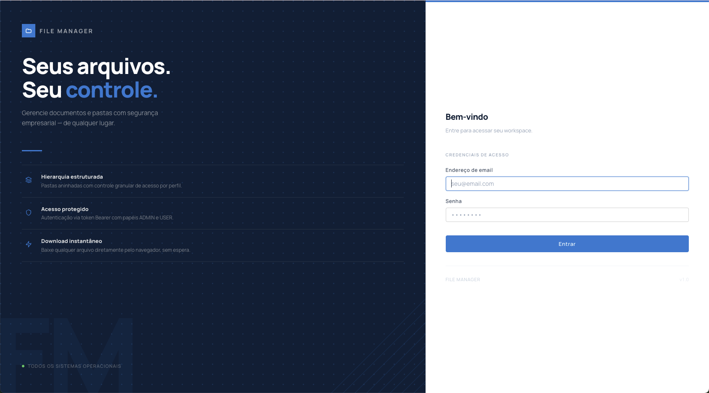
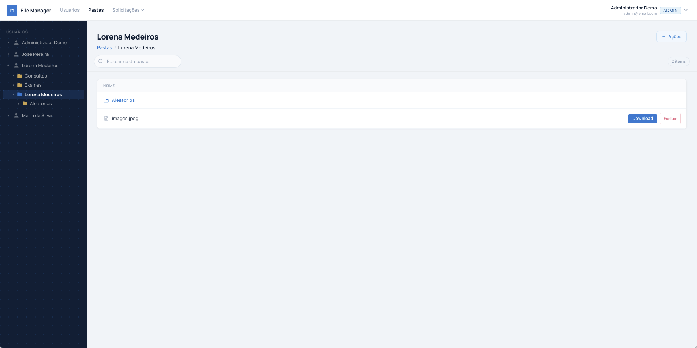
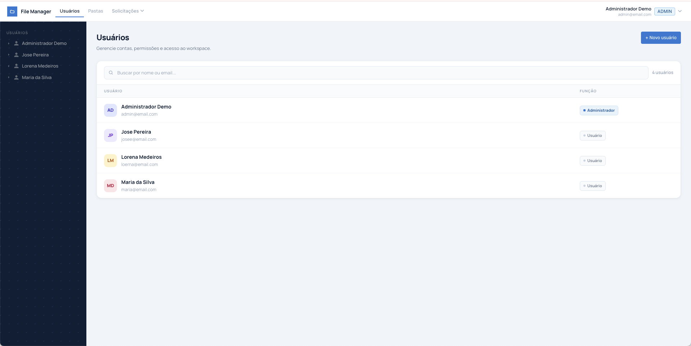
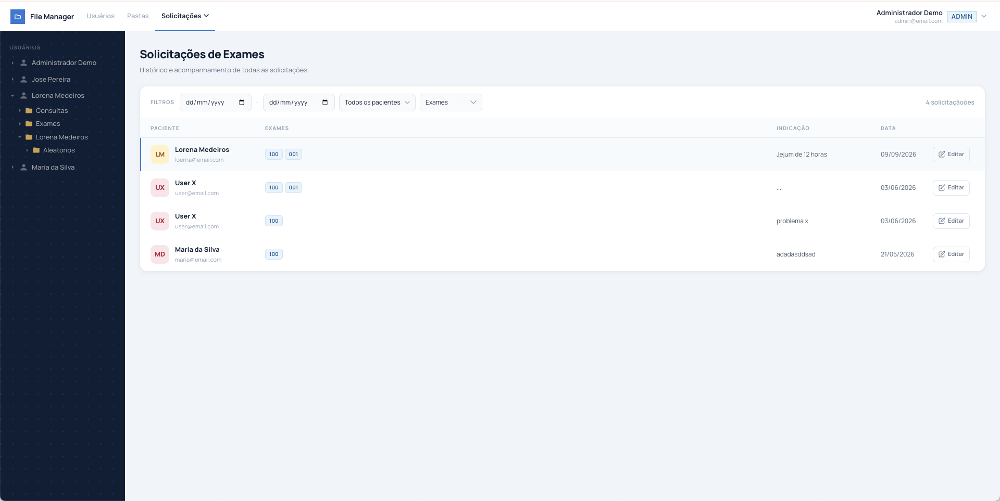

# File Manager

[](https://github.com/RafaelMedeirosDev/file-manager/actions/workflows/ci.yml)
[](LICENSE)

Aplicação full stack em TypeScript para gestão de arquivos por usuário, organizada como um monorepo com API REST em NestJS, SPA em React e um pacote de contratos compartilhados entre as duas pontas.

**Aplicação no ar:** [file-manager.up.railway.app](https://file-manager.up.railway.app)
**Documentação da API:** [`/docs`](https://file-manager-production-355f.up.railway.app/docs) — Swagger UI, com as 27 rotas e o botão *Authorize* para colar um token

> O acesso de demonstração será liberado junto com a organização de demo, atualmente em preparação. Para explorar o sistema completo agora, siga [Como executar o projeto](#como-executar-o-projeto) — o seed cria um `ADMIN` e um `USER` prontos para uso.

| Pacote | Stack | Porta padrão |
|---|---|---|
| `back-end/` | NestJS 11 + Prisma 7 + PostgreSQL | `3000` (via `PORT`) |
| `front-end/` | React 18 + Vite 5 | `5173` |
| `shared/` | `@file-manager/shared` — enums e contratos de API | — |

---

## Sobre o projeto

O **File Manager** é uma aplicação web que centraliza o armazenamento e a organização de documentos por usuário, com controle de acesso por papéis e persistência dos arquivos em armazenamento de objetos na nuvem.

O problema que ele resolve: em operações onde cada cliente/usuário possui um conjunto próprio de documentos, é comum que os arquivos fiquem espalhados em e-mails, drives pessoais e pastas locais, sem controle de quem acessa o quê. O File Manager oferece uma hierarquia de pastas por usuário, uma pasta padrão criada automaticamente no cadastro, upload e download autenticados, e regras explícitas de permissão em cada rota da API.

Além do núcleo de arquivos, o projeto implementa um segundo domínio voltado a **exames laboratoriais**: um catálogo de exames classificados por categoria e um fluxo de solicitação de exames vinculado a um usuário, com geração de PDF da solicitação no frontend. Esse módulo indica que a aplicação foi construída no contexto de um laboratório ou clínica, onde a gestão documental e a solicitação de exames convivem no mesmo sistema.

Trata-se de um **monorepo full stack**: backend (API REST), frontend (SPA) e um pacote compartilhado convivem no mesmo repositório, gerenciados por pnpm workspaces e Turborepo.

---

## Telas

### Login

Ponto de entrada da aplicação. A autenticação é via JWT Bearer, e o token guardado na sessão é enviado por um interceptor do Axios em toda chamada subsequente.



### Pastas e arquivos

A barra lateral monta a hierarquia de pastas por usuário, carregada sob demanda conforme os nós são expandidos. O breadcrumb reflete o caminho da pasta aberta, e cada arquivo é baixado por uma chamada autenticada — o bucket é privado, e o binário é resolvido pela `key` do objeto, nunca por URL pública.



### Usuários

Gestão de contas restrita a ADMIN, com o papel de cada usuário visível na listagem. O cadastro cria automaticamente a pasta padrão do usuário na mesma transação, junto de quaisquer pastas extras informadas.



### Solicitações de exames

Segundo domínio da aplicação: histórico de solicitações com filtros por período, paciente e exame. Cada solicitação relaciona vários exames do catálogo (relação muitos-para-muitos) e uma indicação clínica. Um ADMIN vê todas as solicitações; um USER vê apenas as próprias.



---

## Principais funcionalidades

### Autenticação e controle de acesso
- Login por e-mail e senha com emissão de **JWT** (validade de 1 dia).
- Senhas armazenadas com hash **bcrypt** (10 salt rounds).
- Dois papéis: `ADMIN` e `USER`, aplicados por rota através de guards e do decorator `@Roles(...)`.
- Usuários com `deletedAt` preenchido são bloqueados no login.

### Gestão de usuários
- Listagem paginada com busca por nome e e-mail (executada no banco).
- Criação de usuário com criação simultânea de pastas: uma pasta padrão com o nome do usuário (`isDefault`) e, opcionalmente, uma lista de pastas adicionais, ignorando nomes duplicados.
- Atualização de dados e **soft delete**.
- Troca da própria senha (`PATCH /users/me/password`), disponível para `ADMIN` e `USER`, com validação da senha atual.

### Gestão de pastas
- Hierarquia de pastas com auto-relacionamento (pasta pai → subpastas), com profundidade arbitrária.
- Listagem paginada, com filtro por pasta pai e por raízes.
- Detalhe de pasta retornando ancestrais (breadcrumb), pai, subpastas e arquivos em uma única resposta.
- Criação de um mesmo conjunto de pastas para vários usuários de uma vez (assistente em etapas no frontend).
- **Soft delete**.

### Gestão de arquivos
- **Upload individual** e **upload múltiplo** (até 20 arquivos por requisição), com relatório por arquivo em caso de falha parcial no lote.
- Persistência do binário no **Cloudflare R2** e dos metadados no PostgreSQL.
- **Download autenticado** com streaming pela API, `Content-Type` resolvido por extensão e timeout de 15 segundos na origem.
- Listagem paginada, consulta por ID e **soft delete**.
- Regra de escrita: `ADMIN` pode enviar arquivos para qualquer pasta; `USER` só pode enviar para a própria pasta padrão.

### Exames e solicitações
- Catálogo de exames com código único e categorização em 8 categorias (`THROMBOPHILIA`, `MICROBIOLOGY`, `ENDOCRINE_METABOLIC`, `IMMUNOLOGY`, `OBSTETRIC_MARKERS`, `IMAGING`, `BIOCHEMISTRY`, `HEMATOLOGY`).
- Criação, listagem paginada e **soft delete** de exames.
- Solicitações de exames vinculadas a um usuário, com múltiplos exames por solicitação (relação N–N) e campo de indicação clínica.
- Assistente de criação em 4 etapas no frontend e **geração de PDF** da solicitação com jsPDF.

### Características transversais
- **Soft delete em todas as entidades** — não existe exclusão física de registros no backend.
- **Paginação, filtro e ordenação executados no banco de dados** (`where` / `skip` / `take` no repositório), com resposta padronizada `{ data, meta }`.
- Validação de todo input externo com `class-validator` e `class-transformer` via DTOs.
- Interceptor global de log HTTP (método, rota, status, usuário, IP e duração).
- Níveis de log configuráveis por variável de ambiente.

---

## Tecnologias utilizadas

### Backend
- **NestJS 11** (`@nestjs/common`, `@nestjs/core`, `@nestjs/platform-express`)
- **TypeScript 5.7**
- **Prisma 7** (`@prisma/client`, `prisma`) com driver adapter `@prisma/adapter-pg` sobre `pg`
- **`@nestjs/jwt`** + **Passport** (`@nestjs/passport`, `passport`, `passport-jwt`) para autenticação JWT
- **bcrypt** para hash de senhas
- **class-validator** e **class-transformer** para validação e transformação de DTOs
- **`@aws-sdk/client-s3`** como cliente de armazenamento de objetos
- **Multer** (via `FileInterceptor` / `FilesInterceptor` do `@nestjs/platform-express`) para multipart/form-data
- **dotenv** para carregamento de variáveis de ambiente
- **`@nestjs/swagger`** para a documentação OpenAPI, com o plugin de CLI inferindo os schemas dos DTOs a partir dos decoradores do `class-validator`
- **ESLint 9** (flat config, `typescript-eslint` com `recommendedTypeChecked`) e **Prettier**

### Frontend
- **React 18** + **React DOM 18**
- **Vite 5** (`@vitejs/plugin-react`)
- **TypeScript 5.7** em modo `strict`
- **React Router 6** (`createBrowserRouter`)
- **Axios** com instância única, interceptor de requisição para injeção do token e interceptor de resposta que encerra a sessão em `401` de token expirado
- **Tailwind CSS 3** + **PostCSS** + **Autoprefixer**, complementados por um conjunto próprio de classes de componente em `src/styles.css`
- **jsPDF** para geração do PDF de solicitação de exames
- **serve** para servir o build estático em produção

### Banco de dados
- **PostgreSQL** como provider do datasource.
- **Prisma ORM** como camada de acesso, com **Prisma Migrate** — o histórico conta com **11 migrations** versionadas em `back-end/prisma/migrations/`.
- Modelagem relacional com 5 entidades, chaves primárias em **UUID**, colunas e tabelas em `snake_case` via `@map`/`@@map`, e timestamps (`created_at`, `updated_at`) e soft delete (`deleted_at`) em todas as tabelas.
- A conexão é injetada em tempo de execução pelo **driver adapter** (`PrismaPg` sobre um `Pool` do `pg`), incluindo a seleção do schema — o bloco `datasource` do schema não declara `url`.

### Monorepo e ferramentas
- **pnpm 10** com workspaces (`back-end`, `front-end`, `shared`).
- **Turborepo 2** orquestrando as tasks `build`, `lint`, `lint:ci`, `format`, `test`, `test:e2e`, `dev`, `start:dev` e as tasks de Prisma, com cache e dependências entre pacotes (`dependsOn: ["^build"]`).
- **`@file-manager/shared`**: pacote interno compilado com `tsc` que centraliza enums (`Role`, `ExamCategory`, `ErrorMessagesEnum`) e contratos de API (`ListResponse<T>`, `PaginatedMeta`, `UserItem`, `FolderItem`, `FolderDetails`, `FileItem`, `ExamItem`, `ExamRequestItem`), consumidos pelos dois lados.
- ESLint 9 (flat config) e Prettier estão configurados nos dois workspaces. No `front-end/`, a configuração espelha a do backend e adiciona `eslint-plugin-react-hooks` — com `exhaustive-deps` como **erro**, não aviso.

### Armazenamento externo
- **Cloudflare R2**, acessado pela API compatível com S3 através do `@aws-sdk/client-s3`.
- O cliente é instanciado em `back-end/src/shared/lib/r2Client.ts` com `region: 'auto'` e endpoint montado a partir de `R2_ACCOUNT_ID`.
- O upload usa `PutObjectCommand` e o download usa `GetObjectCommand`, ambos autenticados com as credenciais da aplicação. O objeto é resolvido pela chave (`key`) guardada no banco, e não por uma URL — o que permite manter o bucket privado e elimina a possibilidade de SSRF que existia quando o download buscava um endereço vindo do banco.

### Testes
- **Jest 30** + **ts-jest** para testes unitários no backend: **187 testes em 30 suítes**, cobrindo os 25 use cases (leitura, escrita, upload, download e soft delete) além do fluxo de autenticação.
- **Supertest 7** + **`@nestjs/testing`** para testes end-to-end (3 arquivos em `back-end/test/`): uma suíte dedicada a **RBAC**, que valida os códigos 403/200/201 por papel nas rotas de usuários, pastas e arquivos, e uma de **limites de upload**, que confirma o 413 e o 415 antes de o handler executar.
- Não há suíte de testes no frontend nem no pacote `shared/`.

---

## Arquitetura do projeto

### Visão geral do monorepo

| Pasta | Responsabilidade |
|---|---|
| `back-end/` | API REST em NestJS, camada de persistência com Prisma e integração com o armazenamento de objetos. |
| `front-end/` | SPA em React consumindo a API; organizada por features. |
| `shared/` | Pacote `@file-manager/shared` com enums e contratos de resposta usados por backend e frontend. Fonte única de verdade para os tipos que atravessam a fronteira HTTP. |
| `back-end/prisma/` | Schema, migrations e configuração do Prisma. |

### Arquitetura do backend

O fluxo segue a cadeia **`controller → DTO → use case → repository`**, com responsabilidades estritas:

- **Controllers** (`src/controllers/`, 5 arquivos) — apenas transporte: recebem a requisição, aplicam `ValidationPipe({ transform: true, whitelist: true, forbidNonWhitelisted: true })` no parâmetro, extraem o contexto do requisitante de `req.user` e delegam para um único use case.
- **DTOs** (`src/shared/dto/<domínio>/`) — validam exclusivamente o formato do input com `class-validator`, normalizam strings (`trim`) e e-mails (`trim().toLowerCase()`).
- **Use cases** (`src/usecases/<domínio>/`, 26 arquivos) — concentram as regras de negócio: verificação de propriedade, checagem de soft delete, cálculo de paginação, montagem do `meta` e mapeamento explícito para o objeto de saída. Nunca retornam registros crus do Prisma.
- **Repositories** (`src/repositories/`, 5 arquivos) — única camada que fala com o Prisma. Expõem métodos específicos (`listUsersActive`, `countActiveUsers`, `findActiveByUserIdAndName`, `softDeleteById`) em vez de um acesso genérico ao ORM.
- **Auth** (`src/auth/`) — módulo isolado com `AuthService`, `JwtStrategy`, `JwtAuthGuard`, `RolesGuard` e o decorator `@Roles`.
- **Infra transversal** — `src/database/` (módulo global do Prisma), `src/config/env.ts` (validação centralizada de variáveis de ambiente na inicialização), `src/shared/interceptors/` (log HTTP) e `src/shared/lib/` (cliente R2).

Os providers e controllers são registrados em `src/app.module.ts`; a autenticação permanece encapsulada em `src/auth/auth.module.ts`.

### Arquitetura do frontend

O fluxo segue **`page/layout → hook → service → API`**:

- **`src/app/`** — composição da aplicação: `App.tsx` (provider de autenticação + router), `router.tsx` (definição das rotas), `guards/ProtectedRoute.tsx` (proteção por autenticação e por papel) e `layouts/AppLayout.tsx` (shell com topbar e sidebar).
- **`src/features/<feature>/`** — organização por domínio (`auth`, `users`, `folders`, `exams`, `exam-requests`). Cada feature reúne seus **hooks** (estado assíncrono, paginação, scroll infinito, orquestração de requisições), seus **services** (chamadas HTTP tipadas retornando `response.data`), e, quando necessário, contexts, components e utils próprios.
- **`src/pages/`** — composição visual das telas a partir dos hooks; assistentes em múltiplas etapas para criação de usuário, criação de pastas em lote e solicitação de exames.
- **`src/services/api.ts`** — instância única do Axios, com `baseURL` vinda de `VITE_API_URL` e interceptor que injeta o header `Authorization: Bearer <token>` a partir da sessão em `localStorage`.
- **`src/shared/`** — componentes reutilizáveis (`Modal`), tipos de view e utilitários de normalização de erro e de resposta paginada (`getApiErrorMessage`, `normalizePaginatedResponse`).

Rotas registradas:

| Rota | Proteção |
|---|---|
| `/login` | pública |
| `/` | autenticado (redireciona `ADMIN` → `/users`, `USER` → `/folders`) |
| `/folders`, `/folders/:id`, `/files` | autenticado |
| `/users`, `/users/new` | `ADMIN` |
| `/folders/new` | `ADMIN` |
| `/exams` | `ADMIN` |
| `/exam-requests`, `/exam-requests/new` | `ADMIN` |

---

## Estrutura de pastas

```
file-manager/
├── back-end/
│   ├── prisma/
│   │   ├── migrations/           # 11 migrations versionadas
│   │   └── schema.prisma
│   ├── src/
│   │   ├── auth/                 # AuthService, JwtStrategy, guards, @Roles
│   │   ├── config/               # env.ts — validação das variáveis de ambiente
│   │   ├── controllers/          # User, Folder, File, Exam, ExamRequest
│   │   ├── database/             # PrismaModule (global) + PrismaService
│   │   ├── repositories/         # única camada que acessa o Prisma
│   │   ├── shared/
│   │   │   ├── constants/
│   │   │   ├── dto/              # DTOs por domínio
│   │   │   ├── interceptors/     # HttpLoggingInterceptor
│   │   │   └── lib/              # r2Client
│   │   ├── usecases/             # exam, exam-request, file, folder, user
│   │   ├── app.module.ts
│   │   └── main.ts
│   └── test/                     # testes e2e (app, rbac)
│
├── front-end/
│   └── src/
│       ├── app/                  # App, router, guards, layouts
│       ├── components/           # componentes globais (Sidebar, Icons)
│       ├── features/             # auth, users, folders, exams, exam-requests
│       │   └── <feature>/        # hooks/ services/ components/ contexts/ utils/
│       ├── pages/                # telas
│       ├── services/             # api.ts (instância Axios)
│       ├── shared/               # components, types, utils
│       └── styles.css            # design system em CSS + camadas Tailwind
│
├── shared/
│   └── src/
│       ├── enums/                # Role, ExamCategory, ErrorMessagesEnum
│       ├── types/                # contratos de API (api, user, folder, file, exam...)
│       └── index.ts
│
├── package.json                  # scripts orquestrados pelo Turbo
├── pnpm-workspace.yaml
└── turbo.json
```

---

## Modelagem de dados

Definida em [back-end/prisma/schema.prisma](back-end/prisma/schema.prisma). Provider: PostgreSQL.

### Entidades

| Modelo | Tabela | Descrição |
|---|---|---|
| `User` | `users` | Usuário do sistema. Campos: `id` (UUID), `name`, `email` (único), `password` (hash bcrypt), `role`. |
| `Folder` | `folders` | Pasta pertencente a um usuário. Possui `folderId` opcional para auto-relacionamento (pasta pai) e a flag `isDefault`, que marca a pasta padrão criada junto com o usuário. |
| `File` | `files` | Metadados do arquivo: `name`, `extension`, `key` (chave do objeto no R2, fonte da verdade para leitura), `userId` e `folderId` opcional. A coluna `url` é legado do período em que o bucket era público: não é mais gravada e aguarda remoção, permanecendo apenas nos registros antigos. O binário não é armazenado no banco. |
| `Exam` | `exams` | Item do catálogo de exames: `name`, `code` (único) e `category` (enum `ExamCategory`). |
| `ExamRequest` | `exam_requests` | Solicitação de exames vinculada a um usuário, com o campo textual `indication` e uma coleção de exames. |

### Enums

- **`ROLE`** — `ADMIN`, `USER`.
- **`ExamCategory`** — `THROMBOPHILIA`, `MICROBIOLOGY`, `ENDOCRINE_METABOLIC`, `IMMUNOLOGY`, `OBSTETRIC_MARKERS`, `IMAGING`, `BIOCHEMISTRY`, `HEMATOLOGY`.

### Relacionamentos

| Relação | Cardinalidade | Regra no banco |
|---|---|---|
| `User` → `Folder` | 1–N (obrigatória) | `ON DELETE RESTRICT` |
| `User` → `File` | 1–N (obrigatória) | `ON DELETE RESTRICT` |
| `User` → `ExamRequest` | 1–N (obrigatória) | `ON DELETE RESTRICT` |
| `Folder` → `Folder` (`FolderToFolder`) | 1–N (auto-relação, opcional) | `ON DELETE SET NULL` |
| `Folder` → `File` | 1–N (opcional) | `ON DELETE SET NULL` |
| `Exam` ↔ `ExamRequest` | N–N | tabela de junção implícita `_ExamToExamRequest`, `ON DELETE CASCADE` |

Pastas raiz são identificadas por `folder_id IS NULL`, o que permite navegação hierárquica em profundidade arbitrária.

### Convenções aplicadas

- **UUID** como chave primária em todos os modelos (`@default(uuid()) @db.Uuid`).
- **Timestamps**: `created_at` com `@default(now())` e `updated_at` com `@default(now()) @updatedAt`.
- **Soft delete**: coluna `deleted_at` (nullable) em todas as 5 tabelas. As consultas de listagem filtram `deletedAt: null` diretamente no repositório, e os use cases rejeitam registros marcados como excluídos com `NotFoundException`.
- **Restrições de unicidade**: `users.email` e `exams.code`.
- **Nomenclatura**: modelos em `PascalCase` no Prisma, tabelas e colunas em `snake_case` no banco via `@map` e `@@map`.

---

## Autenticação e autorização

### Fluxo de login

1. `POST /auth/login` recebe `email` e `password` validados por DTO.
2. O `AuthService` busca o usuário por e-mail e rejeita a tentativa caso o usuário não exista **ou** esteja marcado como excluído (`deletedAt`).
3. A senha é comparada com o hash armazenado usando `bcrypt.compare`.
4. Em caso de falha, é lançada uma `UnauthorizedException` com mensagem genérica — a resposta não distingue e-mail inexistente de senha incorreta.
5. Em caso de sucesso, é assinado um JWT com o payload `{ sub, email, role }` e retornado `{ accessToken, user: { id, name, email, role } }`.

O token tem validade de **1 dia** e é assinado com `JWT_SECRET`. **Não há refresh token** — expirado o token, o usuário precisa autenticar novamente.

### Guards e papéis

- **`JwtAuthGuard`** — estende `AuthGuard('jwt')`. A `JwtStrategy` extrai o token do header `Authorization: Bearer`, valida a expiração e **confere o usuário no banco a cada requisição**: se ele foi excluído, o token é recusado na hora, sem esperar a expiração. O papel também é lido do banco, então rebaixar um usuário passa a valer imediatamente.
- **`RolesGuard`** — lê os papéis exigidos com `Reflector.getAllAndOverride`, de modo que um `@Roles(...)` no handler **sobrescreve** o do controller. Sem metadata de papéis, a rota é liberada para qualquer usuário autenticado; sem `req.user`, o acesso é negado.
- **`@Roles(ROLE.ADMIN, ROLE.USER)`** — decorator que declara os papéis permitidos por rota.

Os guards de autenticação e papel são aplicados por controller com `@UseGuards(JwtAuthGuard, RolesGuard)`. Há um guard global de rate limiting registrado via `APP_GUARD`.

### Proteções de transporte

- **Rate limiting** (`@nestjs/throttler`): teto global de 100 requisições por minuto e limite estrito de **5 por minuto no `POST /auth/login`**, que é a única rota pública que recebe credenciais. Excesso devolve **429**.
- **CORS por allowlist**: a variável `CORS_ORIGINS` define as origens aceitas, no lugar de refletir qualquer `Origin`.
- **`helmet`**: aplica `X-Content-Type-Options: nosniff`, HSTS e `X-Frame-Options`. A CSP fica desativada porque a API não serve HTML, e o `Cross-Origin-Resource-Policy` é afrouxado para `cross-origin` de propósito — sem isso o front, que roda em outro domínio, não conseguiria consumir o binário do download.
- **`trust proxy`**: em produção a API fica atrás do proxy da plataforma. Sem essa configuração o Express veria o IP do proxy em toda requisição, e o rate limiting agruparia todos os clientes no mesmo balde — barraria gente legítima sem conter ninguém.

> **Limitação conhecida do rate limiting:** o contador do throttler é mantido em memória. Com mais de uma instância da API atendendo, cada uma mantém a própria contagem e o limite efetivo passa a ser "limite × número de instâncias". Contém abuso automatizado grosseiro, mas não é um limite preciso. Um limite exato exigiria armazenamento compartilhado entre as instâncias.

### Matriz de permissões por rota

| Método | Rota | Papel exigido |
|---|---|---|
| `POST` | `/auth/login` | pública |
| `GET` | `/users` | `ADMIN` |
| `POST` | `/users` | `ADMIN` |
| `PATCH` | `/users/me/password` | `ADMIN`, `USER` |
| `PATCH` | `/users/:id` | `ADMIN` |
| `DELETE` | `/users/:id` | `ADMIN` |
| `GET` | `/folders` | `ADMIN`, `USER` |
| `GET` | `/folders/:id` | `ADMIN`, `USER` |
| `POST` | `/folders` | `ADMIN` |
| `PATCH` | `/folders/:id` | `ADMIN` |
| `DELETE` | `/folders/:id` | `ADMIN` |
| `POST` | `/files/upload` | `ADMIN`, `USER` |
| `POST` | `/files/bulk-upload` | `ADMIN`, `USER` |
| `GET` | `/files` | `ADMIN`, `USER` |
| `GET` | `/files/:id` | `ADMIN`, `USER` |
| `GET` | `/files/:id/download` | `ADMIN`, `USER` |
| `POST` | `/files` | `ADMIN` |
| `PATCH` | `/files/:id` | `ADMIN` |
| `DELETE` | `/files/:id` | `ADMIN`, `USER` |
| `GET` | `/exams` | `ADMIN`, `USER` |
| `POST` | `/exams` | `ADMIN` |
| `DELETE` | `/exams/:id` | `ADMIN` |
| `GET` | `/exam-requests` | `ADMIN` |
| `GET` | `/exam-requests/:id` | `ADMIN` |
| `POST` | `/exam-requests` | `ADMIN`, `USER` |
| `PATCH` | `/exam-requests/:id` | `ADMIN` |

O RBAC não para no guard: os use cases aplicam verificações adicionais de propriedade. Um `USER` só lê e remove arquivos que lhe pertencem, só envia arquivos para a própria pasta padrão, e ao criar uma solicitação de exames tem o `userId` forçado para o seu próprio identificador — apenas um `ADMIN` pode informar um usuário-alvo diferente.

### No frontend

A sessão (`accessToken` + dados do usuário) é persistida em `localStorage` sob a chave `file-manager:session` e exposta pelo `AuthProvider`. O interceptor de requisição do Axios injeta o header `Authorization` automaticamente. O componente `ProtectedRoute` redireciona para `/login` quando não há sessão e para `/` quando o papel do usuário não está entre os permitidos para a rota.

### Documentação da API

`GET /docs` serve o Swagger UI e `GET /docs-json` o documento OpenAPI. As 27 rotas
aparecem agrupadas por domínio, e o botão *Authorize* aceita um token do
`POST /auth/login`, o que permite exercitar as rotas protegidas pela própria
página.

Os schemas de entrada não foram escritos à mão: o plugin de CLI do
`@nestjs/swagger` os deriva dos DTOs, traduzindo os decoradores do
`class-validator` em constraints — `@IsUUID` vira `format: uuid`, `@IsEmail`
vira `format: email`, `@MaxLength` vira `maxLength`, e o enum de categoria de
exame sai com os oito valores. Como os sufixos de arquivo do projeto
(`CreateUserDTO.ts`, `UserController.ts`) diferem dos que o plugin procura por
padrão, eles estão declarados no `nest-cli.json` — sem isso o plugin não
documenta nada, e falha em silêncio.

Duas exceções foram escritas manualmente, porque o plugin não as alcança: o
corpo `multipart/form-data` das duas rotas de upload (o tipo do arquivo vem de
`node_modules` e é descartado na inferência) e a resposta binária do download.

> **Sobre as respostas:** estão documentadas por status e descrição, não por
> schema. Os contratos vivem em `@file-manager/shared` como `type`, para
> atravessarem a fronteira HTTP sem carregar runtime no frontend, e OpenAPI
> precisa de classes para gerar schema de resposta. Duplicar os contratos em
> classes só para a documentação criaria duas fontes de verdade que divergem
> com o tempo — a escolha foi manter uma fonte só e documentar as respostas em
> texto.

---

## Upload e armazenamento de arquivos

### Recebimento

Os endpoints de upload usam os interceptors do `@nestjs/platform-express` sobre o Multer:

- `POST /files/upload` → `FileInterceptor('file')` — um arquivo por requisição.
- `POST /files/bulk-upload` → `FilesInterceptor('files', 20)` — até 20 arquivos por requisição.

Os arquivos são recebidos **em memória** (o buffer é lido diretamente de `file.buffer`); não há gravação em disco no servidor.

### Limites e tipos aceitos

Cada arquivo é limitado a `MAX_UPLOAD_SIZE_BYTES` (padrão 10 MiB), aplicado pelo `limits.fileSize` do Multer — ou seja, no transporte, antes de o handler executar. Um estouro devolve **413** com a mensagem padronizada do `ErrorMessagesEnum`, via um `ExceptionFilter` aplicado apenas às duas rotas de upload.

> Como o armazenamento é em memória, o limite relevante é o agregado: `BULK_UPLOAD_MAX_FILES` × `MAX_UPLOAD_SIZE_BYTES` é o pior caso de heap por requisição de bulk — 200 MiB com os valores padrão. Ao aumentar o limite por arquivo, reduza a quantidade máxima na mesma proporção.

Só são aceitas as extensões do mapa canônico `MIME_BY_EXTENSION` (`xlsx`, `xls`, `pdf`, `csv`, `txt`, `json`, `zip`, `png`, `jpg`, `jpeg`). Formatos que o browser renderiza como documento ativo — `svg`, `html` — ficam deliberadamente de fora. A whitelist nasceu quando os objetos eram servidos publicamente e um arquivo ativo permitiria XSS armazenado; hoje o bucket pode ser privado, mas a restrição continua valendo como defesa em profundidade. Um tipo rejeitado devolve **415**.

O `Content-Type` gravado no R2 é sempre o canônico derivado da extensão, **nunca** o mimetype declarado pelo cliente. Esse é o controle que efetivamente fecha o vetor: sem ele, um `foto.png` anunciado como `text/html` seria servido como HTML mesmo passando pela whitelist de extensão.

**Limitação conhecida:** extensão e mimetype são metadados, não conteúdo. Um arquivo com extensão permitida mas conteúdo malicioso passa pela validação — embora seja servido com o `Content-Type` da extensão, o que impede a execução no browser. Validar o conteúdo de fato exigiria inspecionar os *magic bytes* (assinatura nos primeiros bytes do buffer), o que demanda uma dependência adicional e está registrado nas melhorias futuras.

### Regras de negócio antes da escrita

Implementadas em `UploadFileUseCase` e `BulkUploadFilesUseCase`:

1. A pasta de destino precisa existir e não estar excluída, caso contrário → `NotFoundException`.
2. Se o requisitante é `ADMIN`, o upload é permitido em qualquer pasta e o **dono do arquivo passa a ser o dono da pasta**.
3. Se o requisitante é `USER`, a pasta precisa pertencer a ele **e** ser a pasta padrão (`isDefault`), caso contrário → `BadRequestException`.
4. O dono resolvido precisa existir e não estar excluído.

No upload em lote, a validação da pasta acontece uma única vez e cada arquivo é processado individualmente: falhas isoladas são capturadas e devolvidas na resposta com `{ name, extension, error }`, sem abortar o lote inteiro.

### Persistência do binário

O armazenamento é o **Cloudflare R2**, acessado pela API compatível com S3:

```ts
// back-end/src/shared/lib/r2Client.ts
export const r2Client = new S3Client({
  region: 'auto',
  endpoint: `https://${env.R2_ACCOUNT_ID}.r2.cloudflarestorage.com`,
  credentials: { accessKeyId: env.R2_ACCESS_KEY_ID, secretAccessKey: env.R2_SECRET_ACCESS_KEY },
});
```

O objeto é enviado com `PutObjectCommand` usando uma chave gerada por `randomUUID()` acrescida da extensão original, o que evita colisões e desvincula o nome público do nome informado pelo usuário. O `ContentType` é preservado a partir do mimetype recebido.

### Persistência dos metadados

Após o envio ao R2, é criado um registro na tabela `files` com `name`, `userId`, `folderId`, `extension` e a `key` do objeto (`<uuid>.<extensao>`). A `key` é o único endereço do binário. O binário nunca é gravado no PostgreSQL.

### Download

`GET /files/:id/download` é servido pela própria API, e não por redirecionamento:

- Um requisitante que não seja `ADMIN` precisa ser o dono do arquivo.
- O objeto é lido com `GetObjectCommand`, pela `key` guardada no banco, usando as credenciais da aplicação — sob um `AbortSignal.timeout` de **15 segundos**.
- A resposta é devolvida como `StreamableFile` a partir do corpo retornado pelo SDK, com `Content-Type` preferindo o tipo gravado no próprio objeto e caindo no mapa de extensões conhecidas como fallback, além de `Content-Length` e `Content-Disposition`.
- Falhas são traduzidas em `NotFoundException` (objeto ausente no bucket), `GatewayTimeoutException` (timeout) ou `BadGatewayException` (demais casos).

Ler pelo identificador do objeto, e não por um endereço vindo do banco, é o que torna o modelo de autorização efetivo: como nenhuma URL participa da leitura, não há destino que um requisitante possa influenciar — o vetor de SSRF deixa de existir por construção, em vez de depender de validação.

> **Observações honestas sobre o estado atual:** o bucket é privado — o acesso público está desativado e uma requisição anônima ao endereço antigo responde `401`. URLs pré-assinadas não são usadas, e deixaram de ser necessárias: a API entrega o binário por streaming mantendo o RBAC no servidor. O soft delete de um arquivo remove apenas o registro lógico no banco; o objeto correspondente permanece no bucket.

---

## Decisões técnicas

Algumas escolhas do projeto só fazem sentido junto com o problema que resolvem. Estas são as que mais influenciaram o código.

### Ler o arquivo pela chave, não pela URL

O download antes buscava, com `fetch`, o endereço guardado na coluna `url`. Isso trazia dois problemas ao mesmo tempo: obrigava o bucket a ser publicamente legível — o que tornava as checagens de dono meramente decorativas, já que a URL contornava todas — e, como um `ADMIN` podia gravar qualquer endereço via `PATCH /files/:id`, o servidor podia ser induzido a buscar destinos internos (SSRF).

A solução foi guardar a `key` do objeto e ler com `GetObjectCommand`. Nenhum endereço vindo do banco participa da leitura, então o SSRF deixa de existir **por construção**, e não por validação. A migration derivou a `key` das URLs já existentes (a chave sempre foi o último segmento), então nada precisou ser reprocessado. A coluna `url` continua sendo gravada para permitir rollback.

### Falhar na inicialização quando falta configuração

`VITE_API_URL` não tem valor padrão: o módulo lança erro no boot se ela estiver ausente. O motivo é que as duas alternativas escondem o erro. Um fallback fixo para `localhost` faz um build de produção mal configurado chamar a máquina de quem abriu o site; sem `baseURL`, o Axios monta URLs relativas e as chamadas batem na origem do próprio front. Nos dois casos o sintoma aparece como "falha no login", longe da causa real.

Isso espelha o `required()` de `back-end/src/config/env.ts`, que já derrubava a API na ausência de variável obrigatória.

### `CORS_ORIGINS` é opcional de propósito

Parece incoerente com a decisão anterior, mas não é: `env.ts` é validado no momento do *import*, e os testes importam esse módulo. Uma variável obrigatória nova derrubaria build, testes unitários e e2e de uma vez — o próprio `ci.yml` registra esse comportamento em comentário. Como o CI não tem por que conhecer as origens de produção, a variável tem default de desenvolvimento.

### Nem todo 401 significa sessão expirada

O interceptor de resposta encerra a sessão em `401`, mas com duas exceções explícitas: `POST /auth/login` (credencial errada, onde a tela já mostra o erro inline e deslogar apagaria a mensagem) e `PATCH /users/me/password` (senha atual incorreta, onde o usuário está plenamente autenticado). Sem essa distinção, errar a senha antiga no modal deslogaria a pessoa.

O interceptor também é registrado de dentro do `AuthProvider`, e não no módulo do Axios: limpar o `localStorage` de fora não derrubaria o estado do React, e o app continuaria se comportando como autenticado até um reload.

### `trust proxy` é parte do rate limiting

Em produção a API fica atrás do proxy da plataforma. Sem `trust proxy`, o Express vê o IP do proxy em toda requisição e o throttler agrupa todos os clientes no mesmo balde — barrando gente legítima sem conter ninguém. A configuração não é um detalhe de infraestrutura: sem ela o limite aparenta funcionar e não funciona.

### Containerizar apenas o banco

O `docker-compose.yml` sobe só o PostgreSQL. O gargalo de quem clona o projeto é provisionar o banco, não rodar Node — e containerizar o monorepo inteiro seria trabalho de outra ordem para um ganho pequeno. A API e o front seguem em `pnpm dev`.

### `lint:ci` separado de `lint`

O script `lint` roda com `--fix`, o que em CI corrigiria o problema em silêncio em vez de reprovar o pull request. Por isso existe o `lint:ci`, com `--max-warnings 0`, e é ele que o workflow executa.

---

## Como executar o projeto

### 1. Pré-requisitos

- **Node.js 20+**
- **pnpm 10+** (o repositório fixa `pnpm@10.19.0` no campo `packageManager`)
- **Docker** e **Docker Compose** — para o PostgreSQL local (ou um PostgreSQL próprio, se preferir)
- Um bucket **Cloudflare R2** com credenciais de acesso — **opcional**: necessário apenas para upload e download de arquivos

### 2. Clonar o repositório

```bash
git clone https://github.com/RafaelMedeirosDev/file-manager.git
cd file-manager
```

### 3. Instalar as dependências

```bash
pnpm install
```

O script `prepare` do pacote `shared/` compila automaticamente `shared/dist/` durante a instalação — não é necessário nenhum passo manual em um clone novo.

O `postinstall` do `back-end/` gera o Prisma Client no mesmo momento. Sem ele, `@prisma/client` permanece como stub e o build falha por falta dos tipos gerados (`ROLE`, `PrismaClient`, os modelos).

### 4. Subir o banco de dados

```bash
docker compose up -d --wait
```

Sobe um PostgreSQL 16 na porta 5432, com volume persistente. O `--wait` só retorna quando o banco aceita conexão, evitando rodar a migration cedo demais.

Se você já usa a porta 5432, exporte `POSTGRES_PORT=5433` e ajuste a porta no `DATABASE_URL`.

### 5. Configurar as variáveis de ambiente

```bash
cp back-end/.env.example back-end/.env
cp front-end/.env.example front-end/.env
```

Preencha os valores conforme a seção [Variáveis de ambiente](#variáveis-de-ambiente). A aplicação valida as variáveis obrigatórias na inicialização e falha imediatamente com uma mensagem explícita caso alguma esteja ausente.

### 6. Executar as migrations

```bash
pnpm prisma:migrate:dev
```

Em ambientes de produção, use `pnpm prisma:migrate:deploy`.

### 7. Popular o banco

```bash
pnpm --dir back-end prisma:seed
```

Cria os usuários iniciais e uma amostra do catálogo de exames. O seed é idempotente — rodar de novo não duplica nada.

| Papel | E-mail | Senha |
|---|---|---|
| `ADMIN` | `admin@filemanager.dev` | `admin123` |
| `USER` | `user@filemanager.dev` | `user123` |

Sem este passo não há como entrar na aplicação: a criação de usuários pela API é restrita a `ADMIN`.

> **Sobre o Cloudflare R2:** o `.env.example` traz placeholders nas variáveis `R2_*`, o que permite a API subir e login, usuários, pastas, exames e solicitações funcionarem normalmente. Apenas **upload e download de arquivos** exigem um bucket real — substitua os placeholders por credenciais válidas para exercitar essas rotas.

### 8. Executar em desenvolvimento

Ambos os serviços em paralelo:

```bash
pnpm dev
```

Ou individualmente:

```bash
pnpm start:dev     # apenas a API, em modo watch
pnpm start:front   # apenas o frontend (Vite, porta 5173)
```

### 9. Build de produção

```bash
pnpm build          # todos os workspaces via Turbo (shared → back-end → front-end)
pnpm build:back     # apenas o backend
pnpm build:front    # apenas o frontend
```

### 10. Executar os testes

```bash
pnpm test                       # testes unitários (atualmente apenas o back-end possui suíte)
pnpm --dir back-end test:e2e    # testes end-to-end do backend
pnpm --dir back-end test:cov    # relatório de cobertura
```

> **Os testes e2e exigem o banco de pé e com as migrations aplicadas.** A suíte
> `organization-isolation.e2e-spec.ts` sobe o `AppModule` inteiro, com
> repositórios e `PrismaService` reais — mockar repositório não provaria
> isolamento, porque ele vive exatamente nos `where` deles. Ela cria duas
> organizações de teste com e-mails sufixados por `@isolation-e2e.test` e as
> remove no fim, mas escreve no banco apontado por `DATABASE_URL`.

> Após alterar qualquer arquivo em `shared/src/`, execute `pnpm --dir shared build` antes de subir os servidores ou rodar os testes.

---

## Variáveis de ambiente

### Backend — `back-end/.env`

```env
# Database
DATABASE_URL=
DATABASE_SCHEMA=

# JWT
JWT_SECRET=

# App
PORT=3000
NODE_ENV=development
LOG_LEVELS=log,error,warn
MAX_UPLOAD_SIZE_BYTES=10485760
CORS_ORIGINS=http://localhost:5173

# Cloudflare R2
R2_ACCOUNT_ID=
R2_ACCESS_KEY_ID=
R2_SECRET_ACCESS_KEY=
R2_BUCKET_NAME=
```

| Variável | Obrigatória | Descrição |
|---|---|---|
| `DATABASE_URL` | Sim | String de conexão do PostgreSQL. |
| `DATABASE_SCHEMA` | Não | Schema usado pelo driver adapter do Prisma. Se omitida, as queries usam o `search_path` padrão da conexão — `public`, no PostgreSQL. |
| `JWT_SECRET` | Sim | Segredo usado para assinar e verificar os tokens JWT. |
| `PORT` | Não | Porta da API. Valor padrão no código: `3000`. |
| `NODE_ENV` | Não | Ambiente de execução. Padrão: `development`. |
| `LOG_LEVELS` | Não | Lista separada por vírgula entre `log`, `error`, `warn`, `debug`, `verbose`, `fatal`. Padrão: `log,error,warn`. |
| `MAX_UPLOAD_SIZE_BYTES` | Não | Tamanho máximo aceito por arquivo no upload, em bytes. Padrão: `10485760` (10 MiB). |
| `CORS_ORIGINS` | Não | Origens aceitas pelo CORS, separadas por vírgula. Padrão: `http://localhost:5173`. Uma barra ao final é ignorada. **Em produção precisa listar o domínio do frontend**, senão a API rejeita as chamadas dele. |
| `R2_ACCOUNT_ID` | Sim | Account ID do Cloudflare R2 — usado para montar o endpoint do cliente S3. |
| `R2_ACCESS_KEY_ID` | Sim | Access key de acesso ao bucket. |
| `R2_SECRET_ACCESS_KEY` | Sim | Secret key de acesso ao bucket. |
| `R2_BUCKET_NAME` | Sim | Nome do bucket de destino dos uploads. |

A validação e os valores padrão estão centralizados em [back-end/src/config/env.ts](back-end/src/config/env.ts). As variáveis marcadas como obrigatórias interrompem a inicialização da aplicação se estiverem ausentes.

### Frontend — `front-end/.env`

```env
VITE_API_URL=http://localhost:3000
```

| Variável | Obrigatória | Descrição |
|---|---|---|
| `VITE_API_URL` | **Sim** | URL base da API. Não há fallback: o módulo lança erro na inicialização se a variável estiver ausente, em vez de tentar uma origem errada em silêncio. Em desenvolvimento, `http://localhost:3000`. |

> Nenhum valor real de credencial deve ser versionado. Os arquivos `.env` estão listados no `.gitignore`; apenas os `.env.example` são rastreados.

---

## Scripts disponíveis

### Raiz (orquestrados pelo Turborepo)

| Script | Descrição |
|---|---|
| `pnpm dev` | Executa `dev` e `start:dev` em todos os workspaces (API em watch + Vite). |
| `pnpm build` | Builda todos os workspaces respeitando a ordem de dependências. |
| `pnpm lint` | Executa o ESLint com `--fix` nos workspaces que possuem o script. |
| `pnpm lint:ci` | Executa o ESLint sem `--fix` e com `--max-warnings 0`. É o comando que o CI usa. |
| `pnpm format` | Executa a formatação nos workspaces que possuem o script. |
| `pnpm test` | Executa os testes unitários dos workspaces. |
| `pnpm test:e2e` | Executa os testes end-to-end. |
| `pnpm start:dev` | Sobe apenas o backend em modo watch. |
| `pnpm start:front` | Sobe apenas o frontend. |
| `pnpm build:back` / `pnpm build:front` | Builda apenas um dos workspaces. |
| `pnpm prisma:generate` | Gera o Prisma Client. |
| `pnpm prisma:migrate:dev` | Cria e aplica migrations em desenvolvimento. |
| `pnpm prisma:migrate:deploy` | Aplica as migrations pendentes (produção). |

### `back-end/`

| Script | Descrição |
|---|---|
| `build` | Compila a API com `nest build`. |
| `start` / `start:dev` / `start:debug` | Sobe a API em modo normal, watch ou debug. |
| `start:prod` | Executa o build compilado (`node dist/src/main.js`). |
| `lint` | Executa o ESLint com `--fix`. |
| `lint:ci` | Executa o ESLint sem `--fix`, com `--max-warnings 0`. |
| `format` | Formata `src/` e `test/` com Prettier. |
| `test` / `test:watch` / `test:cov` / `test:debug` | Testes unitários com Jest, em suas variações. |
| `test:e2e` | Testes end-to-end via `test/jest-e2e.json`. |
| `prisma:seed` | Popula o banco com usuários iniciais e exames de exemplo. |
| `prisma:generate` / `prisma:migrate:dev` / `prisma:migrate:deploy` / `prisma:studio` | Comandos do Prisma. |

### `front-end/`

| Script | Descrição |
|---|---|
| `dev` | Servidor de desenvolvimento do Vite (porta 5173, `strictPort`). |
| `build` | Type-check com `tsc -b` seguido do build do Vite. |
| `lint` | ESLint com `--fix` sobre `src/**/*.{ts,tsx}`. |
| `lint:ci` | ESLint sem `--fix`, com `--max-warnings 0`. |
| `format` | Prettier sobre `src/**/*.{ts,tsx}`. |
| `preview` | Serve localmente o build gerado. |
| `start` | Serve o diretório `dist` com `serve` na porta definida por `$PORT`. |

### `shared/`

| Script | Descrição |
|---|---|
| `build` | Compila os contratos com `tsc` para `shared/dist/`. |
| `prepare` | Executa o build automaticamente após `pnpm install`. |

---

## Status do projeto

**Funcional e em evolução.** O núcleo da aplicação está implementado ponta a ponta: é possível autenticar, gerenciar usuários, navegar pela hierarquia de pastas, enviar e baixar arquivos com armazenamento em nuvem, e operar o catálogo de exames e as solicitações.

**O que está consolidado**
- Separação de camadas consistente no backend, com 5 controllers, 26 use cases e 5 repositories seguindo o mesmo padrão.
- RBAC aplicado por rota e reforçado por regras de propriedade dentro dos use cases, com cobertura em teste e2e.
- Soft delete uniforme em todas as entidades, sem nenhuma exclusão física no backend.
- Paginação, filtro e contagem executados no banco, com contrato de resposta padronizado.
- Contratos de API compartilhados entre backend e frontend por um pacote único, evitando divergência de tipos.
- **187 testes unitários em 30 suítes**, cobrindo os 25 use cases e o fluxo de autenticação, mais 10 testes e2e em 3 suítes.
- Leitura dos arquivos autenticada pelo SDK, sem depender de endereço público, o que elimina o SSRF por construção.
- Rate limiting, CORS por allowlist e `helmet` no transporte; sessão e papel conferidos no banco a cada requisição.
- Ambiente publicado, com CI rodando build, lint e as duas suítes de teste em todo pull request.

**O que está parcial ou pendente**
- **Sem testes no frontend** — não há runner configurado. O lint cobre o workspace (com `react-hooks/exhaustive-deps` como erro), mas não há teste de hook ou de componente.
- **Respostas do OpenAPI sem schema.** O plugin de CLI infere os schemas dos DTOs de entrada a partir do `class-validator`, mas os corpos de resposta não estão declarados: o `/docs` mostra os parâmetros de cada rota, não o formato do retorno.
- **Sem CD.** O deploy existe e está no ar, mas é acionado fora do pipeline: o CI valida o pull request e não publica nada.
- **Sem acesso de demonstração aberto.** O ambiente está publicado, mas ainda não há uma organização de demo com credenciais para visitantes.
- **Rate limiting sem precisão em ambiente multi-instância** — o contador vive em memória, então cada instância mantém a própria contagem (ver a nota em Proteções de transporte).
- Camada de estilos mista no frontend: classes utilitárias do Tailwind, um design system em CSS puro e blocos de estilo injetados em tempo de execução em algumas páginas convivem no mesmo projeto.
- Ausência de arquivo de licença.

**Inconsistências conhecidas**
- O soft delete de arquivos não remove o objeto correspondente do bucket R2.
- `PATCH /folders/:id` (renomear pasta) existe na API, com RBAC e teste, mas nenhuma tela do frontend chama a rota.

---

## Aprendizados e pontos técnicos demonstrados

- **Desenvolvimento full stack em TypeScript**, com tipagem compartilhada atravessando a fronteira HTTP através de um pacote interno.
- **API REST com NestJS 11** aplicando injeção de dependência, módulos, interceptors e uma arquitetura em camadas explícita (`controller → DTO → use case → repository`).
- **Autenticação JWT** com Passport e hash de senhas com bcrypt.
- **Controle de acesso por papéis** implementado em duas frentes complementares: guard declarativo por rota e verificação de propriedade dentro das regras de negócio.
- **Modelagem relacional com Prisma**, incluindo auto-relacionamento para hierarquia de pastas, relação N–N e um histórico de 11 migrations que evidencia evolução incremental do schema.
- **Uso de driver adapter do Prisma** (`@prisma/adapter-pg`) com controle explícito de pool e schema.
- **Paginação, busca e contagem no banco de dados**, evitando filtragem em memória, com contrato de resposta padronizado `{ data, meta }`.
- **Integração com armazenamento de objetos** via SDK compatível com S3, incluindo geração de chave, preservação de mimetype, upload em lote com tolerância a falhas parciais e download por streaming com timeout.
- **Soft delete consistente** aplicado como política do domínio inteiro.
- **Validação de dados de entrada** com DTOs, `class-validator` e normalização de campos.
- **Organização em monorepo** com pnpm workspaces e Turborepo, incluindo ordenação de builds por dependência entre pacotes.
- **Frontend organizado por features**, com separação entre página, hook e service, rotas protegidas por autenticação e por papel, e assistentes em múltiplas etapas.
- **Testes automatizados** com Jest e Supertest, incluindo uma suíte dedicada a validar o comportamento do RBAC por código de status HTTP.

---

## Melhorias futuras

- Introduzir um runner de testes no frontend e cobrir hooks e utilitários.
- Adicionar CD ao pipeline de CI, para que o deploy passe pelo mesmo gate dos testes.
- Abrir uma organização de demonstração, com credenciais de acesso para visitantes.
- Containerizar a API e o front, e subir um S3 local (MinIO) para que o upload funcione sem credenciais reais do R2.
- Validar o conteúdo real dos arquivos por *magic bytes*, complementando a checagem de extensão e mimetype.
- Enviar os uploads em streaming direto para o R2, eliminando o buffer em memória e o limite agregado do bulk.
- Remover o objeto no R2 (ou movê-lo para uma área de retenção) quando o arquivo for excluído logicamente.
- Adotar um `ValidationPipe` global e um filtro global de exceções, reduzindo repetição nos controllers e padronizando o corpo das respostas de erro.
- Implementar refresh token, para que a sessão não expire de uma vez após um dia.
- Unificar a estratégia de estilos do frontend, eliminando os blocos de CSS injetados em tempo de execução.
- Adicionar capturas de tela da interface ao README.
- Dar precisão ao rate limiting em ambiente multi-instância, com armazenamento de contagem compartilhado.

---

## Autor

Desenvolvido por **Rafael Medeiros**.

GitHub: [@RafaelMedeirosDev](https://github.com/RafaelMedeirosDev)
